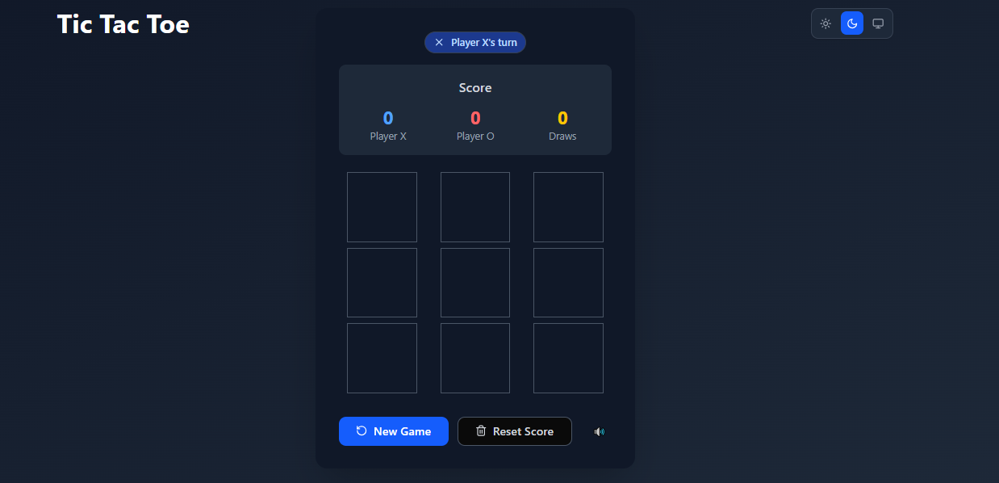

# Tic-Tac-Toe

A modern, accessible, and responsive Tic-Tac-Toe game built with **React 19**, **Next.js 15**, **Tailwind CSS 4**, and **shadcn/ui**.

## ✨ Features

- **Classic Tic-Tac-Toe** gameplay (2 players)
- **Responsive design** for mobile, tablet, and desktop
- **Light, dark, and system theme** toggle
- **Score tracking** for X, O, and draws
- **Reset** for game and score
- **Accessible**: aria-labels, keyboard navigation, focus states
- **Player indicator** with icon and color
- **Highlight winning line**
- **Sound effects** for moves, wins, and draws (with mute toggle)
- **Beautiful UI** with shadcn/ui and Tailwind
- **Deployed on Vercel**

## 🛠️ Tech Stack

- [React 19](https://react.dev/)
- [Next.js 15 (App Router)](https://nextjs.org/)
- [Tailwind CSS 4](https://tailwindcss.com/)
- [shadcn/ui](https://ui.shadcn.com/)
- [Lucide Icons](https://lucide.dev/)
- [TypeScript](https://www.typescriptlang.org/)

## 🚀 Getting Started

1. **Clone the repo:**
   ```bash
   git clone https://github.com/your-username/tic-tac-toe.git
   cd tic-tac-toe
   ```
2. **Install dependencies:**
   ```bash
   npm install
   ```
3. **Run the development server:**
   ```bash
   npm run dev
   ```
   Open [http://localhost:3000](http://localhost:3000) to view the app.

4. **Build for production:**
   ```bash
   npm run build
   npm start
   ```

## 🌈 Accessibility & UX

- **Keyboard navigation:**
  - Use Tab/Shift+Tab to move between cells and buttons
  - Use Arrow keys to move between board cells
  - Use Enter/Space to place a mark
- **Screen reader support:**
  - All buttons and cells have descriptive `aria-label`s
- **Focus states:**
  - All interactive elements have visible focus rings
- **Player indicator:**
  - Shows whose turn it is with color and icon
- **Winning line:**
  - Highlights the three winning cells
- **Sound effects:**
  - Move, win, and draw sounds (with mute toggle)

## 🖼️ Screenshots




## 🌐 Deployment

This app is ready to deploy on [Vercel](https://vercel.com/):

1. **Push to GitHub**
2. **Import your repo on Vercel**
3. **Set build command:** `npm run build`
4. **Set output directory:** `.next`
5. **Deploy!**

## 📄 License

MIT

---

Made with ❤️ for the CAPM/SEMProve coding challenge.
